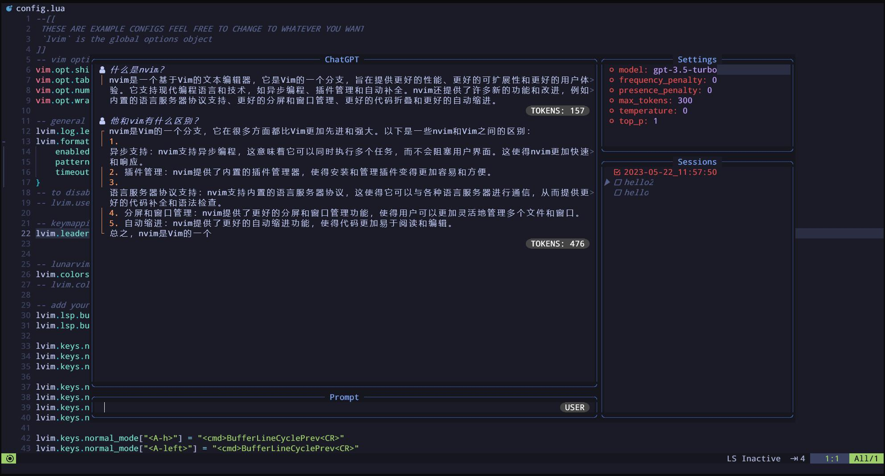

# chatgpt
 

# keymap
注意：关闭gpt窗口要使用`<C-c>`，否则会导致无法再次打开

keymap | note
---|---
`,G` | 打开GPT窗口
`,A` | 打开ChatGPTActAs窗口
`<C-t>` | 提交当前的问题
`<C-n>` | 打开一个新的session
`<C-o>` | 打开setting窗口
`<C-s>` | 打开系统窗口
`<Tab>` | 切换窗口
`<C-c>` | 关闭GPT窗口
`<Space>` | 选中Session
`r` | 给session重命名
`d` | 删除行或者session

# 可能出现的问题
## 1.  Cursor position outside buffer报错
```
删除 ~/.local/state/nvim/chatgpt
```

## 2. 配置`submit=<C-Enter>`后无法触发提交
问题出现在[#170](https://github.com/jackMort/ChatGPT.nvim/issues/170)

参考解决方案 [microsoft/terminal#530 (comment)](https://github.com/microsoft/terminal/issues/530#issuecomment-755917602)

看描述是WSL的问题，最简单的解决方法就是换成别的键去提交


改为<C-g>提交:
```
{
    popup_input = {
        submit = "<C-g>",
    }
}
```

## 3. 出现`ERROR: API Error`报错
该问题为没有配置Api-key

首先确保您有一个ChatGPT的账号，并创建一个api-key，见[chatgpt](https://platform.openai.com/account/api-keys)，创建完成后保存好api-key。

完成以上操作后配置的方法有很多，以下提供最简单的一种：

直接使用环境变量`OPENAI_API_KEY`:
```
export OPENAI_API_KEY = your_api_key
```
这种方法可能会暴露你的api-key给其他进程，且每次重新开启一个terminal会话时都需要手动设置环境变量。可以直接将环境变量添加到用户配置文件中。


在[#185](https://github.com/jackMort/ChatGPT.nvim/pull/185)中，作者提交了`api_key_cmd`参数可以允许将密钥存放到文件或密钥管理程序中(本质就是以字符串执行`apt_key_cmd`)，比如`ob`和`gpg`，具体的可以自行研究。

注意，chatgpt的密钥不要暴露在github上，可能会导致openai回收密钥从而使其失效。
